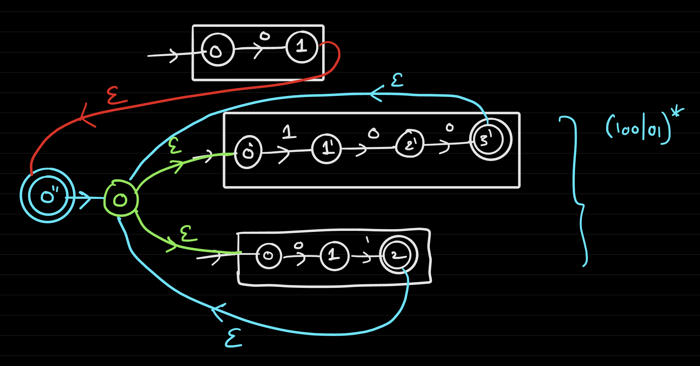
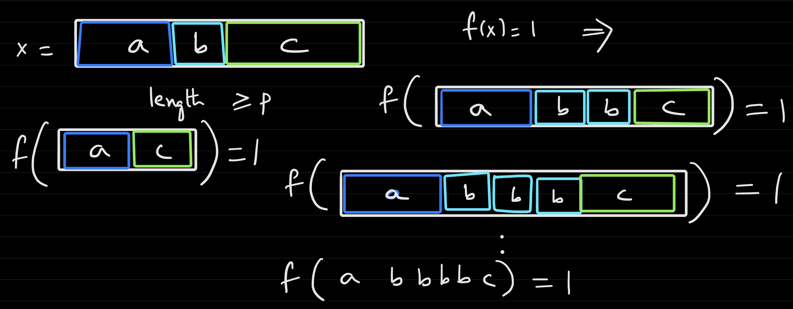
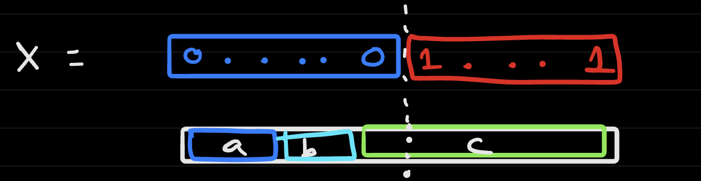

# Lecture 10
## Limitations of Automata
- Given a regex $r$, we can construct a NFA $N$ such that $\forall x$, $x$ matches $r$ (that is, $N(x) = 1$)
  - Example: $r = 0(100|01)^*$
    - 
- DFAs, NFAs, and Regular Expressions are all *equivalent to each other* in terms of computational power
  - A function $f: \{0, 1\}^* \rightarrow \{0, 1\}$ is regular if it is computable by a DFA or a NFA or a regex
  - These models of computations are great for *string matching* as well as *single pass algorithms*
  - From a theoretical standpoint, these models of computations work for *unbounded length inputs* and serve as a nice introduction to *non-determinism* in computations 
- As discussed, DFAs (or NFAs / Regular Expressions) are *limited* by being only *single-pass* - view this as a **memory limit**
  - For instance, considering expressing the majority function `MAJ` using DFAs
    - This is not easy to using DFAs because it is essentially necessary to *count* the number of ones, which can be unbounded (and therefore not expressible with DFAs which have limited memory)
  - Consider the language $L_1$ containing all $x$ such that it has an equal number of `0`'s and `1`'s
    - With the same intuition as `MAJ`, this is not possible to do using DFAs because it is necessary to *count* on a potentially unbounded input
  - Consider the language $L_2$ containing all $x$ contains an equal number of `01`'s and `10`'s
    - This is actually computable via DFA's; $L_2$ is regular and can be computed by a DFA
    - This is because, for this case, a string has an equal number of `01`'s and `10`'s if the first and last bit of the string are the same
      - Even though it *seems* like counting is necessary, it was still possible to represent the language using a DFA via some other clever method
  - The difference between $L_2$ and $L_1$ was that $L_2$ had *overlap* (`01` has overlap with `10`)
### Pumping Lemma
- **Pumping Lemma**: If $f$ is a regular function. Then there *exists* a number *P* such that for every string *x*, $f(x) = 1$ and $|x| \geq P$ can be written as $x = abc$
  - $f(a . b^i . c) = 1$ for all $i \geq 0$
    -  
  - The length of $b$ is not zero
  - The length of $ab \leq P$
- If $f$ is a regular function, this implies there exists a number $P$ such that the lemma holds (that is, $\forall x$, $f(x) = 1$, $|x| \geq P$, there exists $x = a.b.c.$ such that $f(a.b^i.c) = 1$)
  - Intuitively, every sufficiently long $x$ in a language $L$ has a piece that can be repeated while being in $L$
    - This requires that there is a *sufficiently large enough $P$* - for languages where the maximum string length is less than $P$, then the lemma does not really apply (vacuously true)
      - i.e. $L = \{01\}$ does not violate the Pumping Lemma - it can be satisfied with $P = 3$ because there is no accepting string with legnth greater than or equal to 3
- Example: `MAJ` is not regular, using the Pumping Lemma as justification
  - Suppose that `MAJ` was regular, which means that there exists a number $P$ such that the conditions of the pumping lemma hold
  - Let $x = 0...01...1 = (0^P1^P)$
    - By the Pumping Lemma, we should be able to split it up as $x=a.b.c$ such that the the three conditions hold
    - It must be the case that $ab$ be all 0's because the $|ab| \leq P$
      - This contradicts `MAJ(abbc)` = 1, which is a contradiction because `abbc` has more 0's than 1's
      - 
  - The contradiction proves that `MAJ` is not a regular function
- Example: `PALINDROME` is not regular, using the Pumping Lemma as justification
  - Suppose that `PALINDROME` is regular, which implies that there exists some number $P$ such that the conditions of the Pumping Lemma hold
  - Let $x=(0^P)1(0^P) = 0...010...0$
    - The splitting into $a.b.c$ yields a contradiction because $|ab| \leq P$, implying that $ab$ is all zeroes 
    - Thus, $ab^i c$ cannot be in `PALINDROME`, as `abbc` is not palinddromic
- The Pumping Lemma does not hold both ways - that is, satisfying the conditions of the Pumping Lemma is not enough to prove that a function is regular
  - The Pumping Lemma can be used to prove that a function is *not regular* but not able to prove that a function is regular