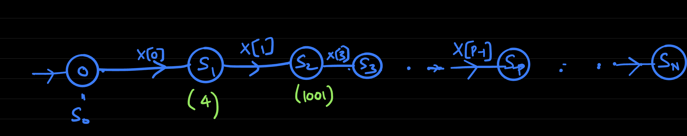
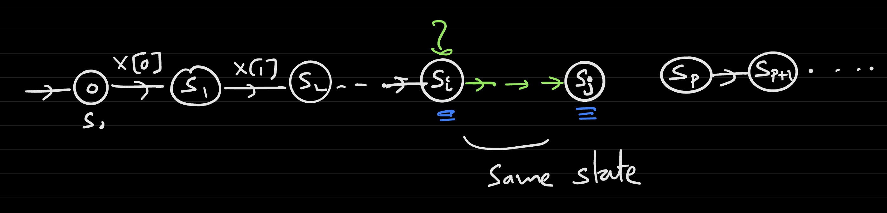
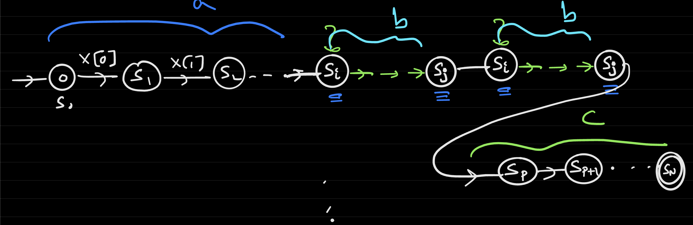

# Lecture 11
## Pumping Lemma and Proof
- Example: Prove $L = \{1^{n^2}: n \geq 1 \}$, or strings with only 1's and the number of 1's is a *perfect square* (i.e. `1`, `1111`, ...), is *not* regular
  - Suppose *L* is regular, then there is some number *p* such that the Pumping Lemma holds
  - Let $X = 1^{p^2} = 1 ... 1$ 
    - This challenge string *cannot* be broken up into $abc$ such that the conditions of the Pumping Lemma holds
    - This is because $x = abbc \notin L$
    - $|abbc| = p^2 + |b| \leq p^2 + p$
      - The length of $ab$ is at most $p$
    - $p^2 + p$ is not necessarily a perfect square, thus proving that $L$ is not regular
      - $p^2 < |abbc| < p^2 + p < (p+1)^2 = p^2 + 2p + 1$
### Proof
- If $L$ is a regular language, there is some number such that for any $x \in L$ of length $\geq p$, it can be written as $x = abc$ where: (i) $ab^ic \in L$, (ii) $b$ is not empty, (iii) $|ab| \leq P$
  - Since $L$ is a regular language, there is a DFA $D$ that computes $L$
  - Let $p$ be the number of states in the DFA $D$
  - Let $x = x[0]x[1]x[2]...x[p-1]x[p]...x[n-1]$
    - $N \geq p$
  - 
    - There are a sequence of $p + 1$ state indices $S_0, S_1, S_2, ... S_p$
      - These indices are in $\{0, 1, ..., p - 1\}$
    - By the Pigeonhole Principle, one state index must repeat because the length of $x$ is greater than or equal to $p$
      - That is, there exists some $i, j \leq p$ such that $S_i = S_j$
      - If there is some *repeated* state index, then all states *between* the repeated indices can be repeated
        - Let the states between the repeated indices be $b$ then, if repeating $b$ leads to the same end state then $abbc \in L$
      - 
- Let $S_0 = 0$ be the starting state and $S_i = T_D(S_{i - 1}, x[i - 1]), i = 1, .., N$
  - As $N \geq P$, we must have two indices $i \neq j$, $i, j \leq p$ such that $s_i = s_j$
  - By the Pigeonhole Principle, some two elements $S_0, S_1, S_2, ..., S_p$ must be identical
  - Let $a = x[0] ... x[i - 1]$
  - Let $b = x[i]x[i + 1] ... x[j - 1]$
  - Let $c = x[j] ... x[n-1]$
  - Intuitively, think of $b$ representing a *loop* of states - that is, following the DFA from $b$ will result in the same end state, so repeating $b$ will have the same effect as simply including it once
    - 
## Turing Machines
- **Turing machines** are another model of computation that can deal with an arbitrary length of inputs
  - They are as powerful a model as there can be because they extend the limitations of DFAs (which are restricted to *single-pass algorithms* and *constant memory*)
  - To be more precise, Turing machine have variable memory and allow the "pointer" to the current input bit to move left or right (think of DFAs or NFAs as a "pointer" that can *only* move right)
    - Aside from these two modifications, Turing machines function similarly to DFAs
- Anatomy of a Turing Machine:
  - Imagine an infinite "tape" (array) with *cells* that are initially loaded with the input and the rest of the cells are empty
  - There is a *head* pointer that starts at the very beginning of the input
    - This head can move *left*, *right*, or *stay*
  - Although memory is infinite, the number of states $k$ is *finite*
    - This can be intuitively thought of as making the *description* of the machine inherently finite
    - State is *separate* from memory
  - Operation:
    - If at state $i$ and head reads symbol $a$, then:
      - Change the state to some other state 
      - Write something at the current head position 
      - Move the head (left, right, stay, or halt/terminate)
- Formal Definition:
  - Let there be $k$ states
  - Let there be an alphabet $\Sigma \supseteq \{0, 1, \Delta, \emptyset \}$
    - $\Delta$ is notation for the start of the tape
    - $\emptyset$ is notation for nothing in the cell (empty)
  - Let there be a transition function $\delta: \{0, 1, ..., k - 1\} \times \Sigma \rightarrow \{0, 1, ... k - 1\} \times \Sigma \times \{L, R, S, H\}$
    - $\delta(state[i], a) = (state[j], b, movehead)$