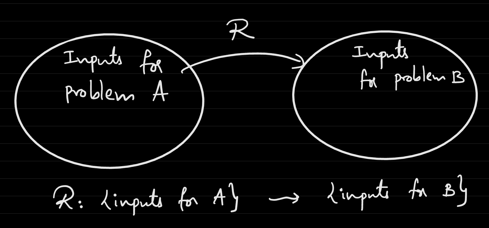

# Lecture 14
## Uncomputability
- Recall that all Turing Machines can be mapped to a bit string: $M \rightarrow <M>$
  - This is analogous to a program and its source code in binary
  - If a bit string does not correspond to a valid program, then it can default to a dummy program that always returns `0`
- **Turing 1936**: There are functions that are not computable
  - Example:
    -     Input: Some number of equations in variables
            i.e. x1^2 + x2^2 + x3^2 = 11
                 10x1 + 100x5 + x6 = 17
                 ...
          Output: 1 If the system has solutions over integers 
          and 0 otherwise
    - Turing showed that this function is *uncomputable*
- `TODD`: $\{0, 1\}^* \rightarrow \{0, 1\}$. `TODD(<M>)` = $\{1$ if M(\<M\>) = 0 and $0$ otherwise $\}$
  - To be specific `TODD(<M>)` will output 1 if $M$ halts on `<M>` with 0 as output, will output 0 if $M$ does not halt on `<M>`, and will output 0 if $M$ halts but has output not equal to 0
  - This function is **uncomputable**
    - Attempt:
      -     def TODDFIRSTATTEMPT(<M>):
              Run M on <M>
              If output = 0:
                return 1
              Else:
                return 0
      - This does not work, because M does not half on `<M>`, then the first line of the program runs *forever*
  - Proof: Suppose there is a Turing Machine $N$ that computed `TODD`. What should the output of $N(<N>)$ be?
    - Case 1: If $N(<N>) = 0$, then this implies that $TODD(<N>) = 1$, which is a contradiction
    - Case 2: If $N(<N>) = 1$, then this implies that $TODD(<N>) = 0$, which is another contradiction
    - Case 3: If $N(<N>)$ does not halt, then it does not match $TODD(<N>)$. 
    - Due to these contradictions, it *must* be the case that the assumption that `TODD` is computable is false
  - This method of proof follows a **diagonalization** approach
## Halting Problem
- `HALT`: $\{0, 1\}^* \rightarrow \{0, 1\}$. `HALT(<M>, x)` = $\{$ $1$ if M halts on $x$ and $0$ else $\}$
  - `HALT` is another uncomputable function
  - Consider the Goldbach Conjecture, which states that every even number can be written as a sum of two primes
    - If `HALT` could be computed, then the Goldbach Conjecture could be solved
      -     def isPrime(n):
              for a in range(2, n):
                if n % a == 0:
                  return 0
              return 1
            n = 4:
            while (true):
              GoldbachN = false
              for p in range(2, n):
                if isPrime(p) and isPrime(n - p):
                  GoldbachN = true
                  Break
              if GoldbachN == true:
                n = n + 2
              else:
                return 0
      - If it could be determined whether this program halts or not, then the Goldbach conjecture could be solved - but obviously this is very challenging
- Proof:
  - Approach: Solve `TODD`, which is known to be uncomputable, using `HALT`
    -     SolveTODDUsingHALT:
            Input: <M>
            Output: TODD(<M>)
            Code:
              If HALT(<M>, <M>) == 0:
                return 0
              Run M on <M>
              If output == 0:
                return 1
              Else:
                return 0
    - If `HALT` were computable, then `TODD` is computable, which is a contradiction - so **HALT is uncomputable**
## Reductions
- The aforementioned proof of `HALT`'s uncomputability utilized a **reduction** - that is, we showed that `TODD` reduces to `HALT`
- In general, a reduction from problem $A$ to problem $B$ implies that, if problem $B$ can be solved, then problem $A$ can be solved
  - If $B$ is computable, then $A$ is also computable
  - If $A$ is uncomputable, then $B$ is also uncomputable
- **Karp Reduction**
  - Consider inputs for problem $A$ and inputs for problem $B$
  - In a Karp reduction, the inputs for problem $A$ are mapped to inputs for problem $B$
    - 
  - The specification is $R: \{0, 1\}^* \rightarrow \{0, 1\}$
  - The utility of this is that $\forall x$ which are inputs to problem A, $A(x) = B(R(x))$
  - This reduction requires that $R$ itself is computable
- In a Karp reduction, the blackbox reduction is done only once
  - In a **Turing / Cook** reduction, the reduction blackbox can be accessed as many times as necessary, and the outputs can be processed further
- Reductions are useful to easily check the computability of problems from known computable or uncomputable problems
- Example: If $f: \{0, 1\}^* \rightarrow \{0, 1\}$ is uncomputable, then $NOT(f): \{0, 1\}^* \rightarrow \{0, 1\}$ is uncomputable
  - Proof: We can reduce `f` to `NotF` by running `NotF` and then outputting the opposite
  - This is a reduction (technically a Cook reduction)
- Example: `HALTOnZero`: $\{0, 1\}^* \rightarrow \{0, 1\}$. `HALTOnZero(<M>)` = $\{$ $1$ if $M$ halts on input $0$ and $0$ if $M$ does not halt on input $0$ $\}$
  - It can be shown that `HALT` reduces to `HALTONZero`
  - We want `HALT(<M>, x)` = `HALTOnZero(R(<M>, x))`
  - Reduction: `HALT(M, x) = HALTOnZero(R(M, x))`
    -     If HALT(M, x) == 1:
            HALTOnZero(R(M, x)) = 1
          If HALT(M, x) == 0:
            HALTOnZero(R(M, x)) = 0
    - `HALTOnZero` is uncomputable since `HALT` is clearly uncomputable