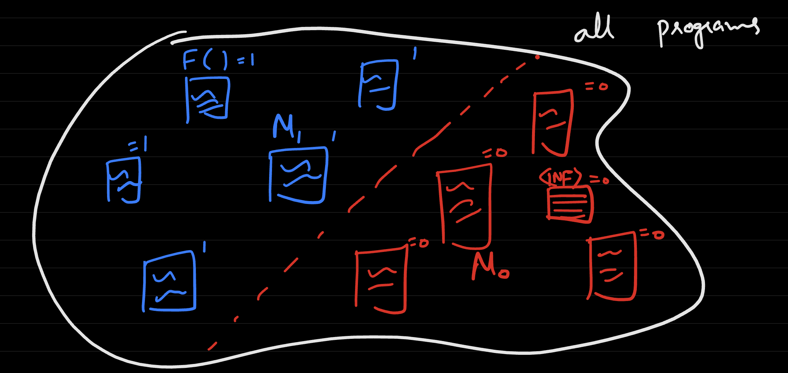

# Lecture 15
## Alternative Proof for HALT
- Recall: `HALT`: $\{0, 1\}^* \rightarrow \{0, 1\}$. `HALT(<M>, x)` = {1 if M halts on X and 0 if not}
- Consider a proof by contradiction - that is, suppose there is a machine $H$ that computes `HALT`
- Define another machine `CANTSOLVEME(<M>)`
  -     def CANTSOLVEME(<M>):
          if H(<M>, <M>) == 1: # If <M> halts on itself
            while (true): # Enter an infinite while loop
              a = 1
          else: # If <M> does not halt on itself
            return 0
  - If `CANTSOLVEME` is given itself as input (`CANTSOLVEME(<CANTSOLVEME>)`), there is contradictory behavior
    - If `CANTSOLVEME(<CANTSOLVEME>)` halts, then the program will enter an infinite loop, so it will actually not halt - which is contradictory
    - If `CANTSOLVEME(<CANTSOLVEME)` does not halt, then the program will enter the second branch and halt - which is, once again, contradictory
## More Reductions
- `NOTEMPTY`: $\{0, 1 \}^* \rightarrow \{0, 1\}$. `NOTEMPTY(<M>)` = 1 if there is a $x$ such that $M(x) = 1$ and $0$ otherwise
  - We can perform a reduction from `NOTEMPTY` to `HALTONZERO` to show uncomputability
  -     def N(z):
          if z != 0:
            return 0
          else:
            run EVAL(M, 0)
            return 1
  - In this reduction program, `NOTEMPTY` will only evaluate to true if $M$ halts on zero, because the only case where the reduction function returns $1$ is if the input is zero - and it can only return if $M$ actually halts
  - Since `NOTEMPTY` can be used to compute `HALTONZERO`, and since `HALTONZERO` is uncomputable, there is a contradiction - so `NOTEMPTY` must be uncomputable as well
## Software Verification
- Consider two programs, $A$ and $B$. The idea of **software verification** seeks to determine if the two programs are equivalent (that is, they are computing the same *function*)
  - Two programs $M$, $M'$ are equivalent if $\forall \ x$, $M(x) = M'(x)$ 
- **Semantic Properties** of a program are properties that only depend on the input/output behavior of the program (or Turing Machine) 
  - $F: \{0, 1\}^* \rightarrow \{0, 1\}$ is semantic if for all equivalent programs M, M', $F(M) = F(M')$
    - `HALTONZERO` and `NOTEMPTY` are examples of semantic functions
    - Nonexample: `F(<M>)` = { 1 if <M> ends with a 0 and 0 otherwise}
      - This depends on the *encoding* of the input function $M$, which can vary from an equivalent function $M'$ that has the same input/output behavior but just a different implementaton (and therefore possibly a different encoding)
- **Rice's Theorem (1951)**: Every *nontrivial* semantic property is uncomputable  
  - Nontrivial means that the function is *not constant* (i.e. not a constant `0` or constant `1` function )
  - Consider `ISMAJORITY(<M>)`, which outputs 1 if `<M>` computes `MAJORITY` and 0 otherwise - this is a semantic function
    - `ISMAJORITY` is uncomputable; it can be shown that `HALTONZERO` reduces to `ISMAJORITY`
    - Reduction:
      -     def N(z):
              run EVAL(M, 0)
              return MAJORITY(z)
    - If $M$ halts on zero, then the program will correctly return `MAJORITY`, otherwise it will not
    - Thus, `ISMAJORITY` can be used to solve `HALTONZERO`, which is known to be uncomputable - so there is a contradiction and `ISMAJORITY` must also be uncomputable
  - If $F$ is a semantic property that is *nontrivial*, then this implies that there is a program $M_0$ where $F(<M_0>) = 0$ (and equivalently $F(<M_1>) = 1$)
  -     def INF(z):
          while (true):
            a = 1
  - 
    - Case 1: $F(<INF>) = 0$
      - A reduction can be constructed from $F$ to $HALTONZERO$ 
      -     def N(z):
              run EVAL(M, 0)
              run EVAL(M1, z) # M1 is the program where F evaluates to 1
      - As long as M halts on zero, the second `EVAL` on the function satifies the semantic property $M_1$ should return true - so F should return true if and only if $M$ halts beacuse otherwise it will return 0 because $F(<INF>) = 0$
      - Once again, this proves that $F$ can be used to compute $HALTONZERO$, which is a contradiction - so $F$ must be uncomputable
    - Case 2: $F(<INF>) = 1$
      - In this case, the same approach can be followed but we can just look at `NOTF`, which is semantic
      - `NOTF(<INF>) = 0` implies that `NOTF` is uncomputable, and since we can reduce `NOTF` to `F`, `F` is also uncomputable 