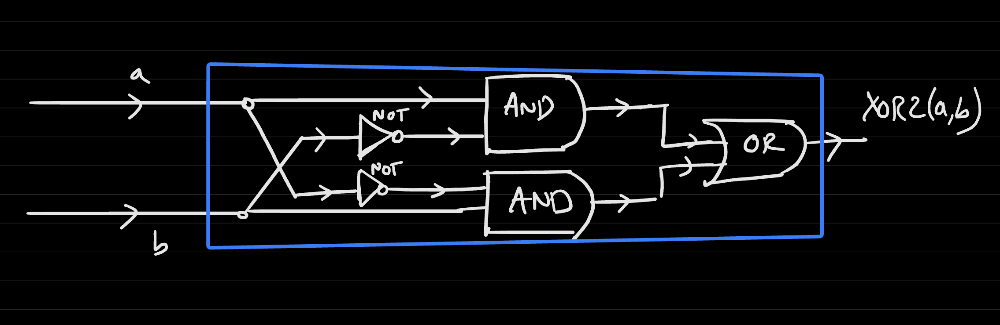
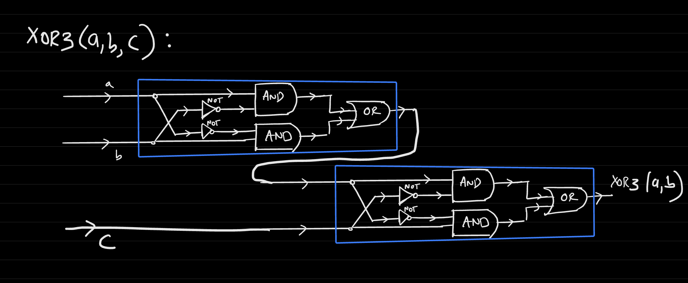
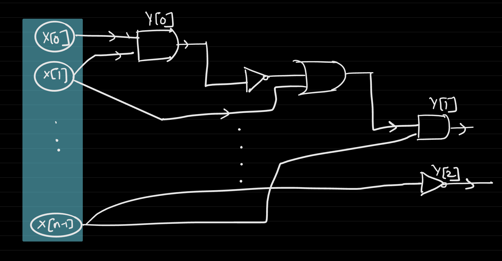
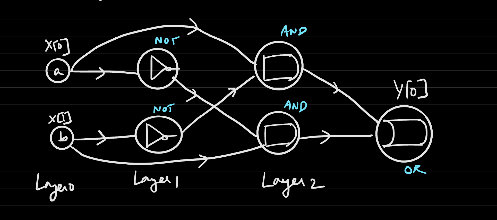

# Boolean Circuits
- Example: Implement two-input XOR using boolean circuits
  - From the truth table:
    - a b xor
      0 0 0
      0 1 1
      1 0 1
      1 1 0
  - Using the truth table, the circuit can be defined in terms of its minterms
    - $XOR(a, b) = (\neg a \land b) \lor (a \land \neg b)$
      - Alternatively: $XOR(a, b) = OR(AND(NOT(a), b), AND(a, NOT(b)))$
- Example: Implement three-input XOR using boolean circuits (if there are an odd number of inputs that are 1, output 1 and otherwise output 0)
  - $XOR3(a, b, c) = XOR2(XOR2(a, b), c)$
    - XOR2 of a and b will only output 1 if there are an odd number of 1's, which forces c to be 0; it will only output 0 if there are an even number of 1's, which forces c to be 1
## Problems and Circuits
- A model of computation can be developed using boolean circuits - to *solve a problem* requires creating a function composed of *basic steps*, which we can define via the *AND/OR/NOT* operations
  - This model is well-suited for the real world because there are physical implementations of Boolean operations (AND/OR/NOT gates) constructed via transistors
- Boolean circuits can be expressed graphically
  - i.e. the `XOR2 Circuit`
    - 
  - i.e. the `XOR3 Circuit`
    - 
## Boolean Circuits
- This notion of circuits can be expressed formally via a **directed acyclic graph**, as there is a clear *order* in which boolean operations are performed (and DAG's are well suited for representing orderings)
- A *(n, m, s)* boolean circuit is a DAG with $n + s$ vertices
  - *n* represents the number of variables, *m* represents the output variables, and *s* represents the size
  - Exactly *n* of these vertices are labeled as inputs - $x[0], x[1], x[2], ..., x[n - 1]$
  - The other *s* vertices are logic gates (AND/OR/NOT)
    - Each `AND` and `OR` gate has exactly 2 inputs, and each `NOT` gate has exactly one input
    - Any of the gates can have any number of outgoing edges (outputs)
  - *m* of the gates are labeled as outputs - $y[0], y[1], ..., y[m - 1]$
  - Example: 
    - 
## Circuits and Computation
- Given a boolean circuit with *n* inputs, *m* outputs, and *s* gates, computation can be represented via the process of:
  - Layering the DAG via a topological sorting so that all *input* vertices are in the first layer of the sorting (they are assumed to have no incoming edges since they are, by definition, inputs)
    - Operations in the same layer can be computed in *parallel* as they depend only on the previous (already computed) layer
  - Assuming that all computation has been done in layers *0, 1, ..., k - 1*:
    - For each vertex in layer *k*:
      - If it is an `AND` gate, assign it the value of the `AND` of its incoming wires
      - If it is an `OR` gate, assign it the value of the `OR` of its incoming wires
      - If it is a `NOT` gate, assign it the value of the `NOT` of its incoming wires
- The *input* of a boolean circuit is $x = x[0], x[1], ..., x[n - 1]$
  - The *output* of a boolean circuit is $y = y[0]y[1]...y[m-1]$
    - The final output is a concatenation of each individual output
  - In other words: $C \{0, 1\}^n \rightarrow \{0, 1\}^m$
- A circuit *C* computes a function *f* if, for every *x*, $f(x) = C(x)$ for all $x \in \{0, 1\}^n$
  - In other words, the circuit computes the exact value that the function computes for every single possible input bit string
- Exampled Formalized Circuit: XOR2
  - 
- Boolean circuits do not necessarily need to be in terms of AND/OR/NOT - they could be in terms of other logical primitives, such as `NAND` gates
  - An $(n, m, s)$ `NAND` circuit is a DAG where there are *n inputs* (x[0], x[1], ..., x[n - 1]), *s* gates each having exactly two incoming wires (computing `NAND`), and *m* vertices labeled (y[0], y[1], ..., y[m -1])
  - This is a different model for computation; Given a `NAND` circuit *C*, we have define a function $C: \{0, 1\}^n \rightarrow \{0, 1\}^m$ that $C$ computes
    - A `NAND` circuit *C* computes a function *f* if *f(x) = C(x)* for all *x*
- Given a `NAND` circuit computing a function *f*, it can be converted into the standard AND/OR/NOT boolean circuit by converting each `NAND` gate into an `AND` followed by a `NOT`
  - Going the other way is also possible, as `AND/OR/NOT` can be expressed via `NAND` gates
    - `NOT` can be expressed by splitting the input into two and passing them through the `NAND` gate
    - `AND` can be expressed by passing the two inputs through a `NAND` gate and then passing it through a `NOT` gate (which can be expressed in terms of `NAND`)
    - `OR` can be expressed by passing the two inputs through a `NOT` gate (expressed in terms of `NAND`) and then passing it through a `NAND`
  - **Theorem**: Boolean circuits are *equivalent* to `NAND` circuits in computational power
    - *f* is computable by a boolean circuit if and only if f is computable by a `NAND` circuit
## Computability of Boolean Circuits
- **Theorem**: Every function $f: \{0, 1\}^n \rightarrow \{0, 1\}^m$ can be computed by a Boolean circuit of size $O(n * m * 2^n)$
  - This size is an upper bound, but there are often cases where functions can have a much smaller size
    - i.e. Addition: $O(n)$
    - i.e. Multiplication: $O(n^2)$
    - The size of the circuit can be corresponded to the time complexity of an algorithm (i.e. a function that sorts in $O(n log n)$ roughly corresponds to a circuit of size $O(n log n)$)