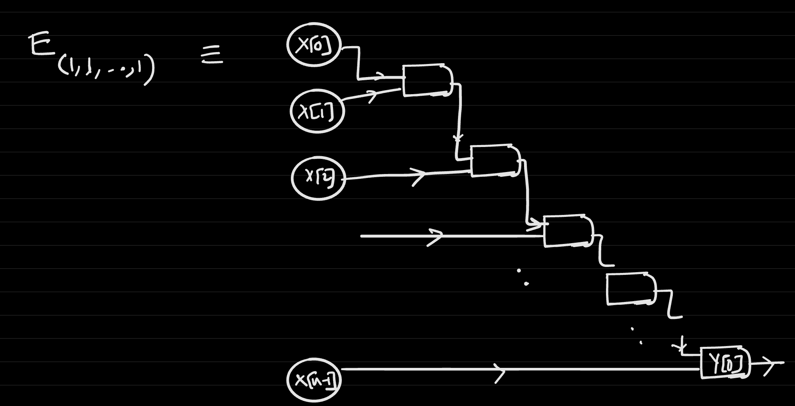
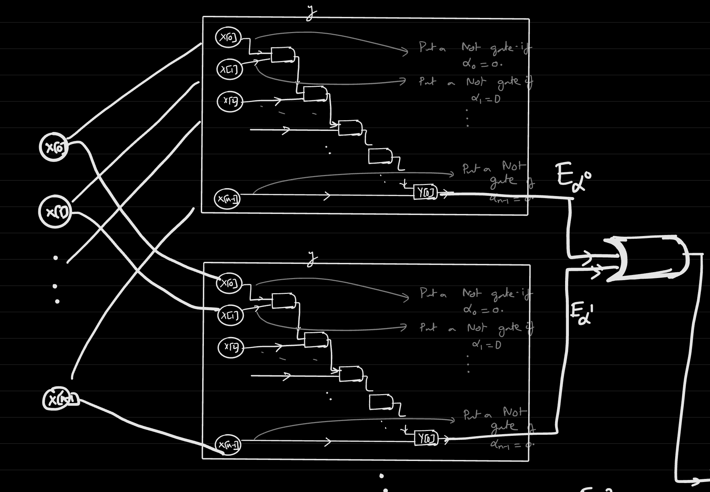
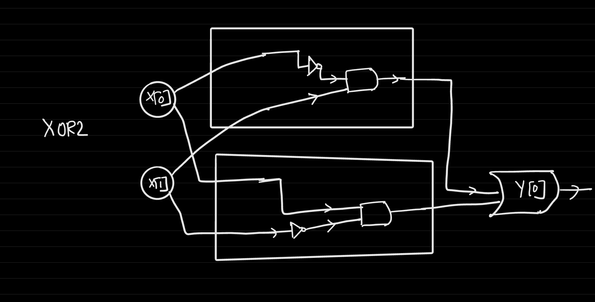
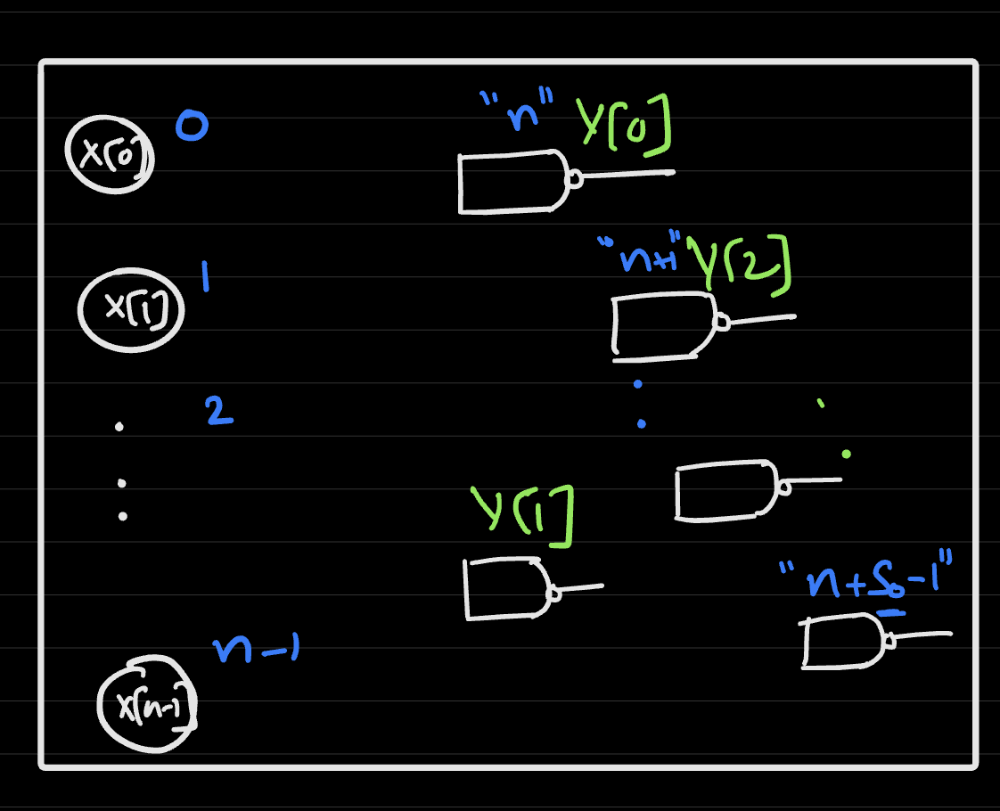
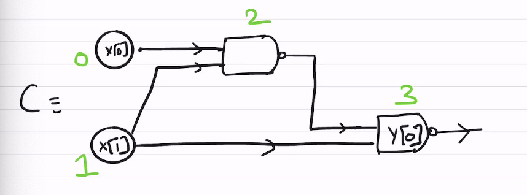

# Computability and Circuits
- **Theorem**: Every function $f: \{0, 1\}^n \rightarrow \{0, 1\}^m$ can be computed by a Boolean circuit of size $O(n * m * 2^n)$
  - Proof (for single output, m = 1): 
    - Think of the specification of this function as being in the form of a truth table - each input string (of length $n$) corresponds to an output string (of length $1$)
      - This truth table would have $2^n$ rows
    - Define $S$ as the set of all input strings where the function evaluates to $1$
      - $S(f) = \{ \alpha \in \{ 0, 1\}^n: f( \alpha ) = 1 \}$
    - For a given string $\alpha \in \{0, 1\}^n$, define a the function $E_{\alpha}: \{0, 1\}^n \rightarrow \{0, 1\}$, where $E_{\alpha}(x) = 1$ if $x = \alpha$ and $0$ otherwise
      - Example: $E_{(1, 1, ..., 1)}(x)$ can be achieved by performing an `AND` between all bits of `x` (since it is checking for an all-one string)
        - Since each gate of a boolean circuit is only allowed two inputs, $E$ can be implemented by *splitting* the `AND` operations into multiple pairs of two
        - 
        - This implementation uses `n - 1` gates
      - Example: $E_{(1, 1, 1, ..., 1, 0)}(x)$ can be achieved by once again performing an `AND` between all bits of `x`, but simply taking the `NOT` of the last, zero bit, before performing an `AND` with another bit
        - This implementation uses `n` gates
      - In general, for any string $\alpha \in \{0 , 1\}^n$, $E_\alpha(x)$ can be computed via a boolean circuit by performing an `AND` with all bits and inverting any `0` bits before undergoing any `AND` operations
        - The size of this circuit is at most `2n - 1` (`n-1` AND gates + possibly `n` NOT gates)
    - Since $S$ is the set of all inputs where the output is $1$, the function $f$ can be represented as an `OR` of each string function in $S$
      - $S(f) = \{\alpha_0, \alpha_1, ..., \alpha_{N-1}\}$
      - $f(x) = OR(E_{\alpha_0}(x), ..., E_{\alpha_{N-1}}(x))$
      - This is analagous to representing a circuit as the `OR` of many minterms
    - Thus, the boolean circuit for $f$ can be built by taking the `OR` of all $E_{\alpha_i}$ functions, where $\alpha_i \in S$
      - 
      - The `OR` operations are chained, and the last `OR` yields the output of $f$
    - This circuit can have at most $O(n * 2^n) gates$
      - There can be at most $2n - 1$ gates in each $E_{\alpha_i}$, there can be `N - 1` or gates, and there can be at most $N = 2^n$ different strings $\alpha_i$
    - This bound can actually improved to $O(\frac{2^n}{n})$ gates
  - The proof can be extended to $m > 1$ by simply repeating the proof for $m = 1$ by $m$ times
- Example: `XOR2`
  -  
- The aforementioned approach allows for any function to be represented as a circuit, but it is still grossly inefficient
  - The n-bit `OR` function, for example: $OR_n: \{0, 1\}^n \rightarrow \{0,1\}$
    - This function can be built very simply by taking the `OR` in pairs (as done before)
    - Using the generalized approach for creating boolean circuits, however, will have $|S| = 2^{n} - 1$ (1 for all strings except for the 0 string), and will therefore result in a circuit with many gates - roughly $(2^n - 1) * 2n$ gates
## Limitations of Circuits
- **Theorem (Shannon 1949)**: Some functions require $\frac{2^n}{24n}$ gates to compute - that is, they require an exponential number of gates
- **Theorem**: Programs themselves can be viewed as inputs - that is, circuits themselves can be represented as $\{0, 1\}^*$ strings
  - Every *(n, m, s)* `NAND` (remember `NAND` circuits can be easily converted to `AND`/`OR`/`NOT`) circuit can be represented by a boolean string of length $O((n + s) * log_2(n + s))$
  - Proof: 
    - Let $Circuit_{n , m}(s) = $ all circuits of $n$ inputs, $m$ outputs, and $s$ gates
      - Let $E: Circuit_{n, m}(s) \rightarrow \{0, 1\}^{Circuit(s)}$
    - Each circuit uses at most $s$ `NAND` gates
    - The encoding of the circuit must specify which nodes correspond to output variables, how many gates are present, how many outputs are present, how many inputs are present, and the incoming wires (inputs) for each gate
    - Encoding: 
      - Number all gates (including inputs) using integers 
        - Outputs are specified as the *indices* (i.e. y[0] is index 1)
        - Connections are also specified as a *pair of indices*
        - 
      - Final Encoding: (n, m, s, index of y[0], index of y[1], ..., index of y[m - 1], index of first connection to gate n, index of second connection to gate n, ..., index of first connection to gate n + s - 1, index of second connection to gate n + s - 1)
        - Since this encoding is just a list of integers, it can easily be represented as a binary string (using prefix-free encodings, i.e. `PNtoB`)
        - Once the binary string is parsed, the decoding into a circuit is also easy because the number of inputs, outputs, and gates is always specified in the beginning of the encoding so there is no ambiguity parsing the rest of it 
    - Example: 
      - 
      - (**2**: *n*, **1**: *m*, **2**: *s*, **3**: *y[0]*, **(0, 1)**: *connection to 2*, **(2, 1)**: *connection to 3* )