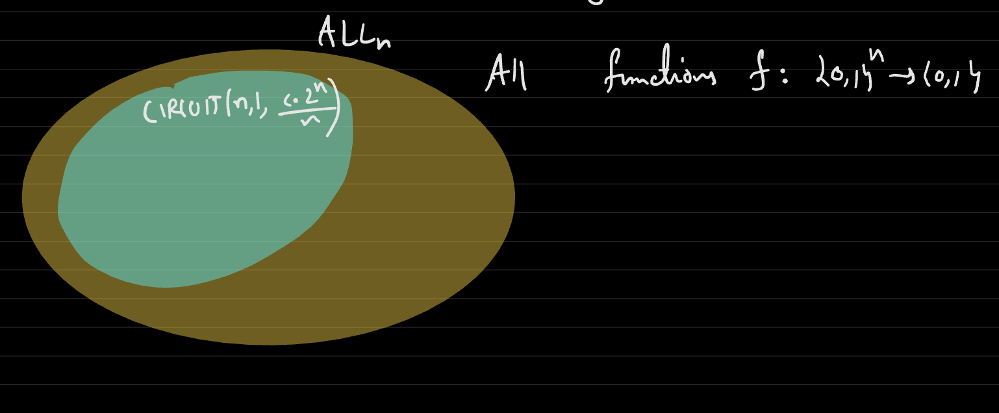
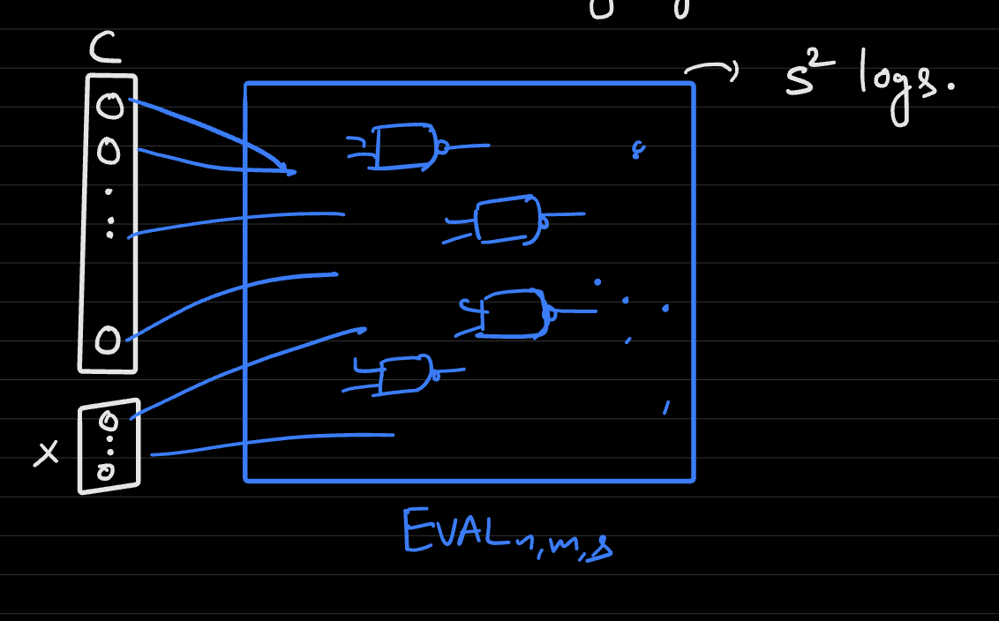

# Lecture 5
## Shannon's Lower Bound
- Theorem: There is an encoding $E: CIRCUIT(n, m, s) \rightarrow \{0, 1\}^*$ such that the length of the encoding is less than $12(n+ s)\log_2(n+s)$
  - Recall that circuits can be encoded into binary strings via the form: 
    - *(n, m, s, index of y[0], index of y[1], ..., index of y[m - 1], index of first connection to gate n, index of second connection to gate n, ..., index of first connection to gate n + s - 1, index of second connection to gate n + s - 1)*
    - This is simply a sequence of prefix-free encoding of integers
    - This representation requires $3 + m + 2s \leq 3 + n + s + 2s = n + 3s + 3$ integers (recall $m$ can be at most $n + s$)  
      - Each integer of magnitude $n$ can be represented by $\log n + 1$ bits, so the representation requires $\log (n + s) + 1$ since the magnitude of each element in the list can be at most $n + s$
      - These integers must be prefix free, so the number of bits to represent them is actually doubled (and two extra bits added) to be $2 \log (n + s) + 4$
      - Thus, the order of the bit representation of the entire list is $(n + 3s + 3)(2 \log(n + s) + 4) \leq 12(n + s) \log_2(n + s)$
- Theorem (**Shannon's**): There exists a function $f: \{0, 1\}^n \rightarrow \{0, 1\}$ that has no `NAND` circuit of size $\leq c \frac{2^n}{n}$ (for some fixed constant greater than zero)
  - Let $ALL_n = \{f: \{0, 1\}^n \rightarrow \{0, 1\}\}$ represent the class of *all* functions
  - Let $CIRCUIT(n, 1, s)$ represent all functions f that are computable by a `NAND` circuit of size less than s
  - Shannon's Theorem is proven based on the foundation that $CIRCUIT$ is a proper subset of $ALL$ - that is, not all functions can be computable by a `NAND` circuit of size less than s
    - 
  - More precisely, it is stating that $|CIRCUIT(n, 1, \frac{c * 2^n}{n})| < |ALL_n|$, and this is proven via *counting* the sizes of each set to show the separation
    - This counting argument can be executed by finding the upper bound length of the binary encoding of each set and determining how many possible binary strings (elements in the set) there are 
  - Claim: $|ALL_n| = 2^{2^n}$
    - A function is defined by all possible output values for each input strings
    - For $n$ input bits, there are $2^n$ possible input strings to the function, each with a single output (in this case)
    - For a single output function, each output can either be zero or one (two options), and there are $2^n$ possible outputs
      - Thus, there are $2^{(2^n)}$ possible functions
  - Claim: $|CIRCUIT(n, 1, \frac{c * 2^n}{n})| \leq \# Circuits \leq 2 * 2^{12(n + s) \log_2 (n + s)}$ 
    - The number of circuits is less than or equal to the number of binary strings of length $L = 12(n + s) \log_2(n + s)$ is just $2^L$, and this is upper bounded by $2^{L + 1} = 2 * 2^L$
      - This is because the upper bound string length for representing a circuit is $12(n + s) \log_2(n + s)$, and there can be $2^{12(n + s) \log_2(n + s)}$ different binary strings of this length
  - Comparing the magnitudes of $2 * 2^{12(n + s) \log_2(n+s)}$ and $2^{2^n}$, it can be mathematically (skipping here) shown that, if $s = \frac{2^n}{24n}$, then for $n \geq 12$, $2 * 2^{12(n + s) \log_2(n + s)} < 2^{2^n}$, thus proving that $|CIRCUIT| < |ALL|$
- What Shannon's Theorem implies is that there exists a function $f$ that requires $\frac{2^n}{24n}$ gates - there is some function out there that cannot be efficiently represented
## Code as Data
- In proving Shannon's Theorem, the fact that circuits themselves can be represented as binary strings was used heavily to **count circuits**
  - This idea is especially important for another reason, though, as it implies that code (represented as circuits) can act as inputs to other circuits - **code can act as data**
- Normally, a circuit takes an input in the form of a binary string and returns an output, also in the form a binary string
  - Let $EVAL: \{0, 1\}^{size(n, m, s)} \times \{0, 1\}^n \rightarrow \{0, 1\}^m$ represent a function that takes in two inputs, a circuit $C$ and an input string $x$, and outputs the output binary string of that circuit
    - $EVAL(C, x) = C(x)$
    - This acts as a sort of "simulator" or "compiler" that allows for different inputs to be applied to the same circuit or different circuits to be applied to the same input
  - In this definition, of `EVAL`, the case where the encoding of the circuit is not valid can be treated based on convention
    - e.g. $EVAL(C, x)$ outputs $C(x)$ if $C$ is a valid circuit and $0^m$ otherwise
- Theorem (**Universal Circuit**): There is a Boolean circuit that computes $EVAL_{n,m,s}$ (which itself has inputs of length $Size(n, m, s) + n$)
  - Proof (Easy Way): It has already been proven that every function has a circuit, and since `EVAL` itself is also a function, we know that `EVAL` itself will have a circuit
  - Theorem: There is a circuit for $EVAL_{n, m, s}$ of size $O(s^2 \log s)$, given that $s \geq n, m$
  - 
    - This allows for any function to be simulated with a single $EVAL$ circuit, provided that the circuit corresponding to the circuit $C$ being simulated meets the constraints of the input size
    - The $EVAL$ circuit does not need to be changed, only the two inputs ($C$ and $x$)
## Physical Extended Church-Turing Thesis (PECTT)
- If a function $f: \{0, 1\}^n \rightarrow \{0, 1\}$ can be computed by using $s$ physical resources, then it can be computed by circuits that use roughly $s$ gates
## Limitations of Circuits
- Circuits are not scalable - to model a function that takes more inputs, you would not need to scale an already existing circuit for that function to take more inputs
  - This is because circuits have *fixed input lengths*
- A different model of computation that can handle *arbitrary-length inputs* is necessary