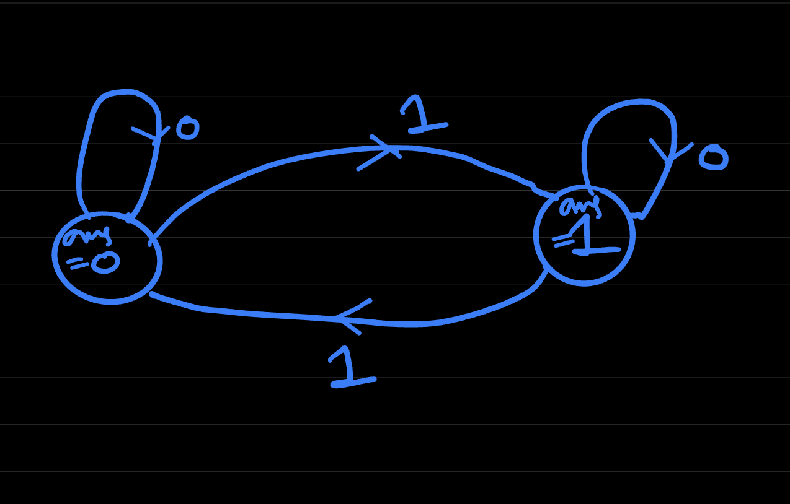
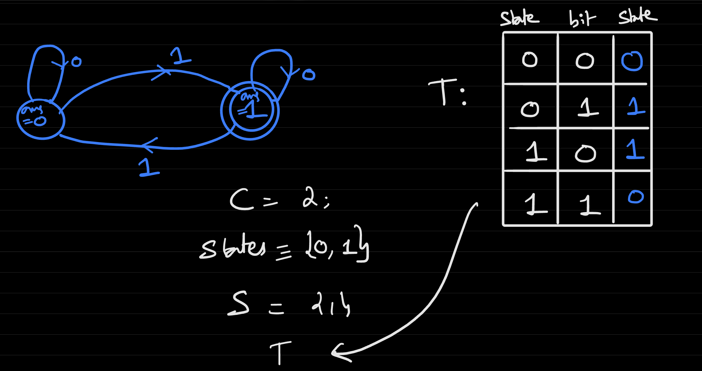
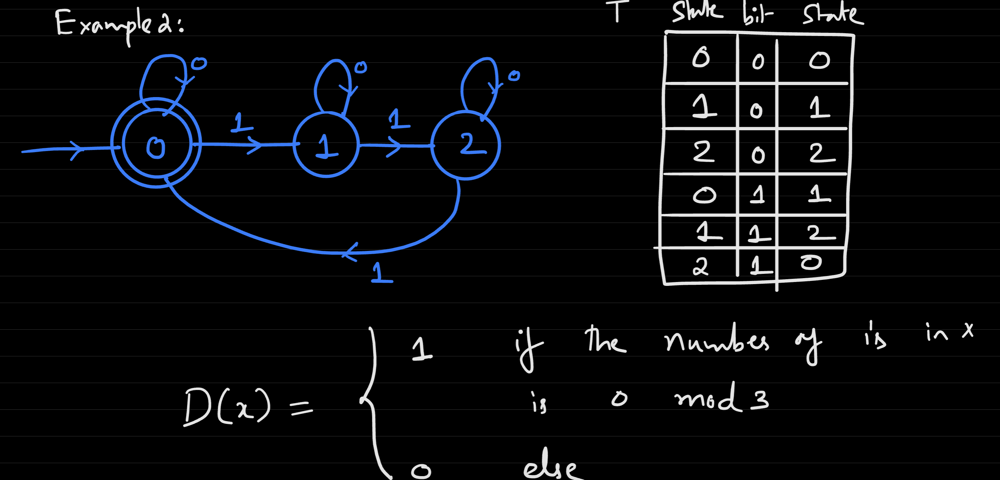
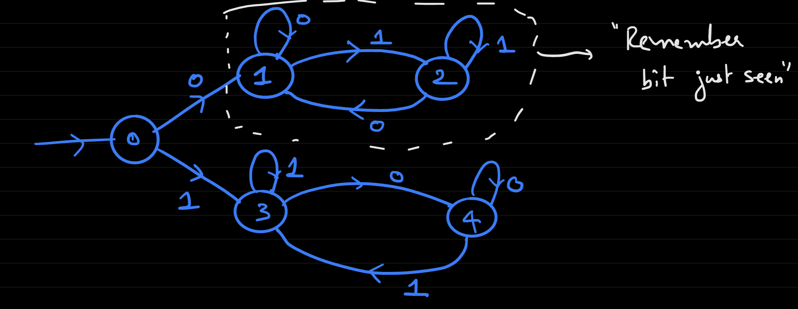
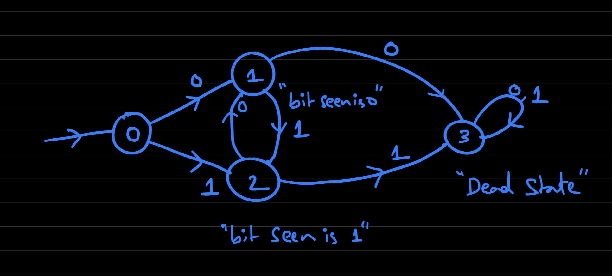
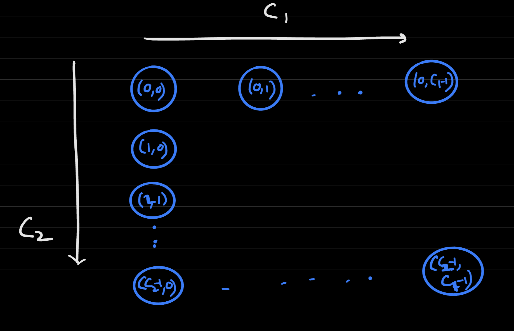

# Lecture 6
- An *algorithm* can be thought of as a *finite answer* (fixed-size code) to an infinite number of questions (inputs of any length)
  - That is, an algorithm can be thought of as a function $f: \{0, 1\}^* \rightarrow \{0, 1\}^*$, with an unbounded input length
- For example, consider a general `XOR` function: $XOR: \{0, 1\}^* \rightarrow \{0, 1\}$  
  - It will output a `1` if the number of `1`'s in the input is odd, and 0 otherwise
  - This `XOR` cannot be implemented using the earlier model of boolean circuits because the inputs are not a fixed length
  - In an algorithm, though, its implementation is clear:
    -     def XOR(X):
            ans = 0
            for i in range(length(x)):
              ans = (ans + x[i]) % 2
            return ans
    - This is a *single-pass*, *constant memory* algorithm, with the following state diagram:
      - 
## Deterministic Finite Automata (DFA)
- Single-pass, constant memory algorithms can be represented via **deterministic finite automata**
- A deterministic finite automata with $C$ states over $\{0, 1\}$ is a pair $D = (T, S)$ where $T: [C] \times \{0, 1\} \rightarrow [C]$ and $S \subseteq C$, which represents a subset of "correct" states
  - $[C] = \{0, 1, 2, ..., C - 1\}$
  - $T(i, a) = j$ jumps to state $j$ if the current state is $i$ and the bit $a$ is read
  - $D: \{0, 1\}^* \rightarrow \{0, 1\}$. On input (x):
    -     Start from state S[0] = 0
          For i = 0, ..., length(x) - 1:
            S[i+1] = T(S[i], x[i])
          Output 1 if final state is in S and 0 otherwise
  - A DFA $D = (T, S)$ computes a function $f: \{0, 1\}^* \rightarrow \{0, 1\}$ if $f(x) = D(x) \forall x \in \{0, 1\}^*$ 
    - Example: The previous general XOR function
      - 
  - When constructing a DFA, $T$ and $S$ are chosen accordingly so that the resulting function matches the specification
- Example: Determines if the number of `1`'s in input X is `0 mod 3`
  - 
  - Here, the accepting states $S = {0}$ because this is the state that corresponds to a true output (that is, if the final state is 0 - the accepting state - then the final output will be 1 to indicate that the number of `1`'s in input X is indeed `0 mod 3`)
- Example: Design a DFA that outputs if the last bit of the input $x$ ends in `1` and `0` otherwise
  - All that needs to be "stored" is the current bit
  - 
- Example: Design a DFA that outputs `1` if the first and the last bits are the same and `0` otherwise
  - 
  - From the initial state (which is typically assumed 0), the path is "split" based on the initial bit
    - Each path tries to remember the bit just seen in order to determine, when it reaches the final bit, if there is a match
    - The valid states in this case is $S = {1, 3}$
- Example: Design a DFA that outputs `1` if the bits are alternating and `0` otherwise
  - e.g. `f(0) = 1`, `f(1) = 1`, `f(010) = 1`
  - Approach: Keep note of alternations until a repeat is found - then stay at a "dead state"
  - 
    - The valid states in this example are $S = {0, 1, 2}$
- Anatomy of a DFA:
  - The number of states $C$, the transition table $T$, and the set of accepting states $S$ are all $bounded$
  - What is unbounded is the input length
- The DFA model is useful in its ability to model for functions with unbounded length inputs
  - The model is also useful for recognizing patterns (string matching / regular expressions)
  - This model leads well into thinking more about non-deterministic computation
## Properties of Deterministic Finite Automatas
- One question is whether it is possible to perform *operations* on functions $f$ computed by DFA's
  - $NOT(f)$:
    - This is easy for perform, as the states that are not accepted and are accepted can just be flipped
    - $\bar{D} = (T, \{0, 1, ..., C - 1\} - S)$
  - $AND(f_1, f_2)$
    - Consider DFA $D_1 = (T_1, S_1)$ computes $f_1$ and has $C_1$ states and DFA $D_2 = (T_2, S_2)$ computes $f_2$ and has $C_2$ states 
    - The approach for performing an `AND` is to run both DFA's in *parallel*
      - This results in states $C = C_1 \times C_2 = (i, j)$, storing all possible combinations of states between the two functions
        - $i \in \{0, 1, ..., C_1 - 1\}$, $j \in \{0, 1, ..., C_2 - 1\}$
        -  
      - $(T(i, j), a) = (T_1(i, a), T_2(j, a))$ 
        - The new state is based on the parallel execution of both functions
      - $S = (i, j)$ if both $i \in S_1$ and $j \in S_2$
  - $OR(f_1, f_2)$
    - The same approach for calculating `AND` can be used, but now the $S = (i, j)$ if *either* $i \in S_1$ or $j \in S_2$ 