# Lecture 7
## Concatenation of DFAs
- Consider $f_1: \{0, 1\}^* \rightarrow \{0, 1\}$ and $f_2: \{0, 1\}^* \rightarrow \{0, 1\}$
- Let us define $f_1 CAT f_2: \{0, 1\}^* \rightarrow \{0, 1\}$
  - $f_1CATf_2(x)$ is 1 if $f_1(x_1) =1$ and $f_2(x_2) = 1$, where $x = x_1x_2$
    - This is *splitting* the input and putting each split as an input - the entire concatenation function is satisfied if each split is satisfied
- 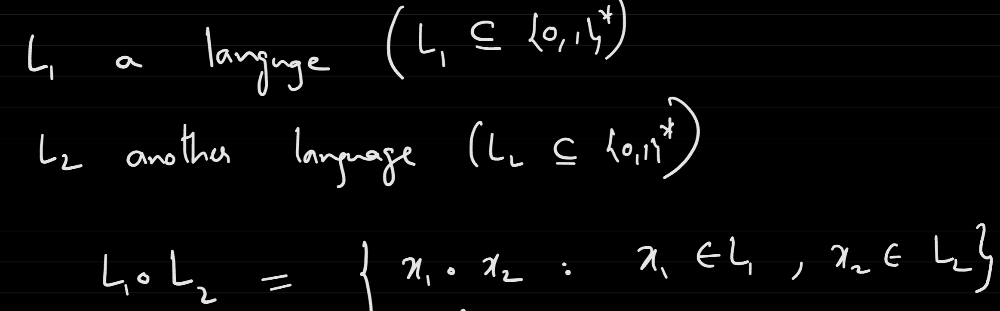
- Example: 
  - $f_1: \{0, 1\}^* \rightarrow \{0, 1\}$, where $f_1(x) = 1$ for all x
    - This function is computable by a DFA:
    - 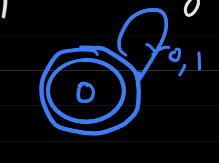
  -  $f_2: \{0, 1\}^* \rightarrow \{0, 1\}$, where $f_2(x) = 1$ if x starts with a 1 and has a length exactly 4 and otherwise is 0
    - 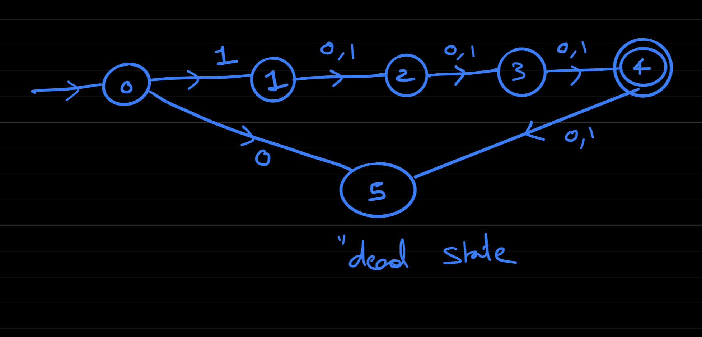
  - $f_1 CAT f_2(x)$ is 1 if the 4th bit from the end is a 1 and is 0 otherwise
    - 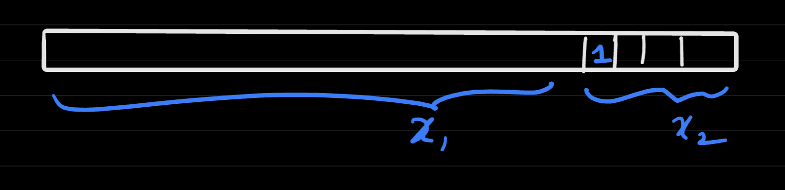
- $f_1 CAT f_2$, in general, can be calculated using DFAs
  - If $f_1: \{0 ,1\}^* \rightarrow \{0, 1\}$, $f_2: \{0 ,1\}^* \rightarrow \{0, 1\}$ are computable by a DFA, then $f_1 CAT f_2: \{0, 1\}^* \rightarrow \{0, 1\}$ is also computable by a DFA
  - Pseudocode Intuition:
    -     def CONCAT(f1, f2, x):
            ans = 0
            for i in range(len(x)):
              x1 = x[0:i]
              x2 = x[i:len(x)]
              if f_1(x) AND f_2(x) == 1:
                return 1
            return 0
      - This is *not* a single pass algorithm
  - Let $f_{reverse}: \{0, 1\}^* \rightarrow \{0, 1\}$ be another operation that evaluates the function but on a reversed $x$ - that is, $f_{reverse}(x) = f(reverse(x))$
    - If $f$ is computable by a DFA, then so is $f_{reverse}$
    - This cannot necessarily be done, though, by just reversing all state directions and changing the starting state to be the ending state  
      - This is not feasible if there are multiple ending states
      - This is also not feasible because multiple outgoing edges will have the same bit labels (multiple zeroes) - this is *nondeterministic*
      - 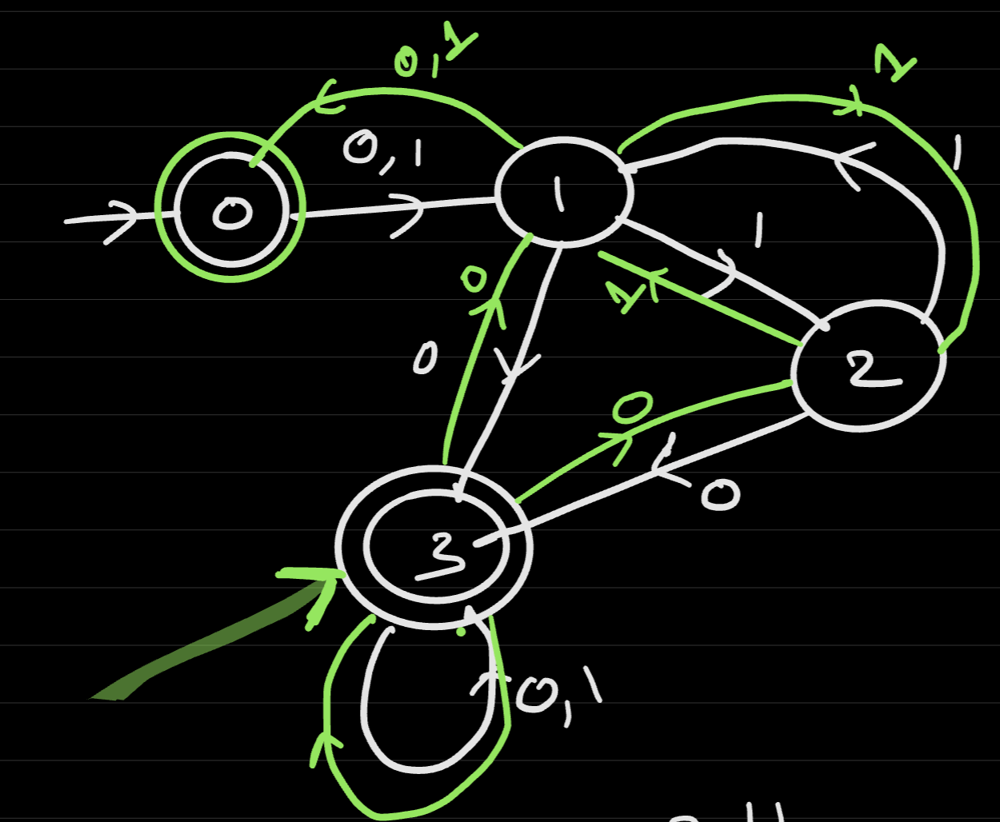
## Non-Deterministic Finite Automata (NFA)
- A **non-deterministic finite automata** can have multiple outgoing edges with the *same label* out of a state, some edges are labeled by $\epsilon$, and some edges can go *missing* (i.e. they go to a dead state - this is just to make syntax easier)
- Example: 
  - 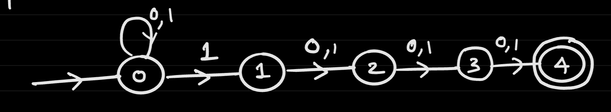
    - There are no outgoing edges from the fourth state, implying that it leads to a *dead state* (it does *not* lead back to itself)
    - There are multiple outgoing arrows labeled 1 for state zero
      - This can be interpreted as there being parallel outcomes depending on which ambiguous choice is chosen (i.e. parallel universes)
      - e.g. for Input `01001`
      - 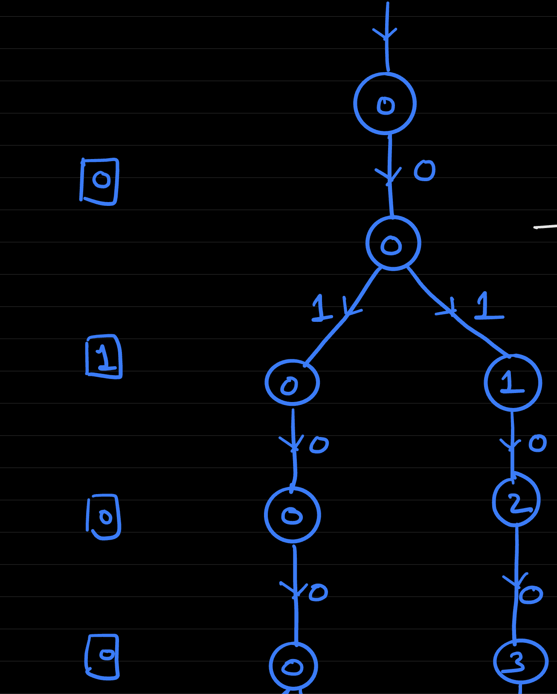 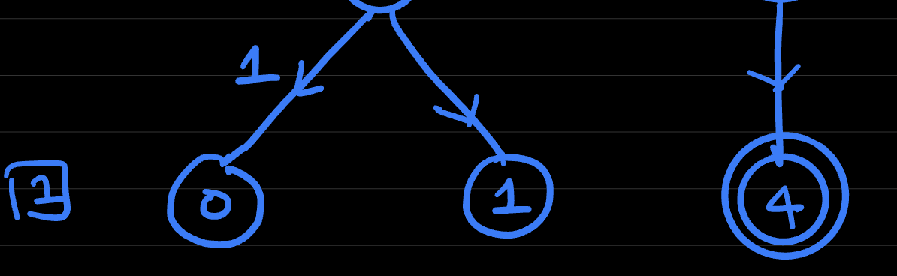
    - If *any* of the parallel branches reach the end state, then one is outputted
- Example: 
  - 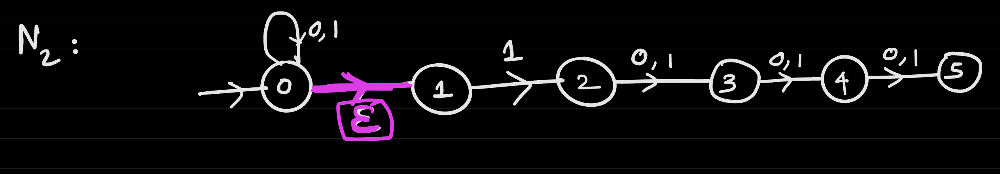
  - Here the $\epsilon$ transition allows for a branch to be created *without* needing to read any input
  - e.g. for Input `01001`
  - 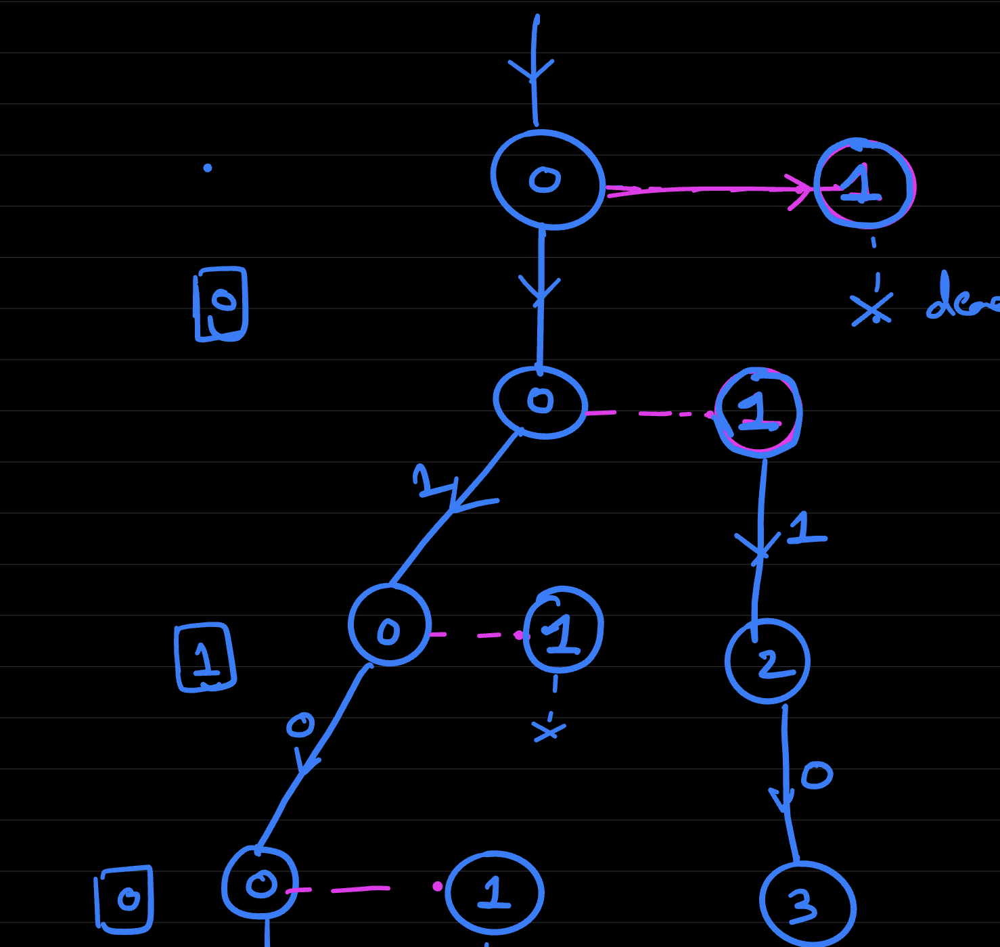 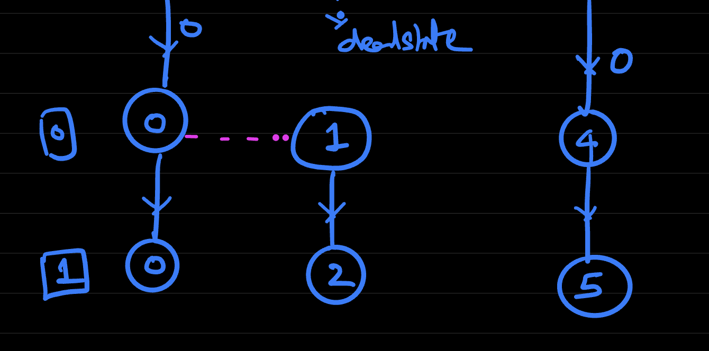
    - This will output 1 because one "branch" reaches state 5
- Formal Definition:  
  - $N = (T, S)$
    - $S \subseteq [C]$
    - $T: [C] \times \{0, 1, \epsilon \} \rightarrow Power([C])$
      - Recall the power set: $[C] = \{0, 1, 2, ..., C - 1\}$, $Power([C]) = {I: I \subseteq [C]}$ i.e. all possible subsets of C, including the empty set $\emptyset$ which represents a dead state
    - On an input $x$, $N(x)$ is $1$ if on any branch the final state is in $S$ and $0$ otherwise
- Formal Example:
  - 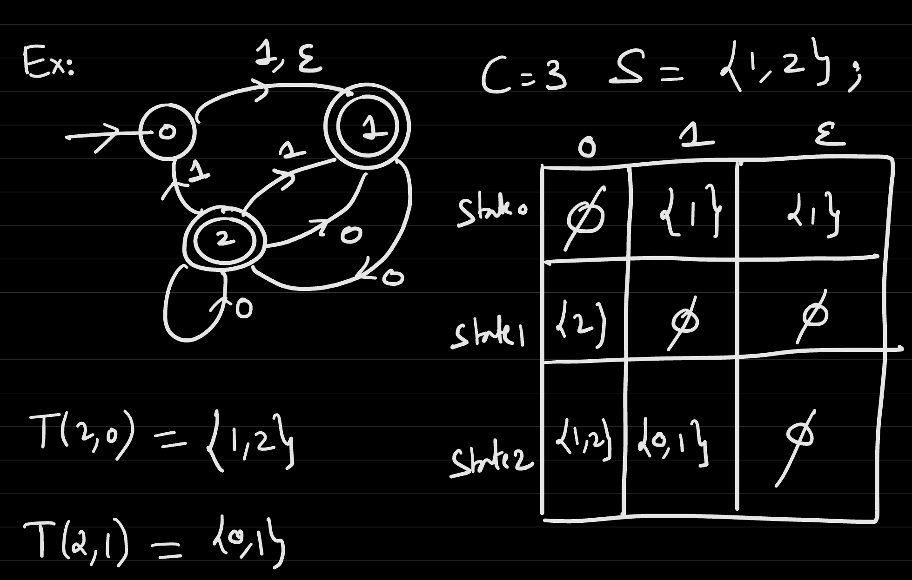
- A function $f: \{0, 1\}^* \rightarrow \{0, 1\}$ is computable by an NFA $N$ if $\forall x$, $f(x) = N(x)$
  - 
    - This NFA checks if the 4th bit from the end is 1
  - 
    - This NFA *also* checks if the 4th bit from the end is 1
- If $f_1: \{0, 1\}^* \rightarrow \{0, 1\}$ is computable by a DFA $D_1$ and $f_2: \{0, 1\}^* \rightarrow \{0, 1\}$ is computable by a DFA $D_2$, then $f_1 CAT f_2: \{0, 1\}^* \rightarrow \{0, 1\}$ is computable by a NFA
  - This leverages the $\epsilon$ transitions to "split" the input - specifically, there are $\epsilon$ transitions from the accept states of $D_1$ to the start states of $D_2$; the accepting states of the NFA are the accepting states of $D_2$
  - 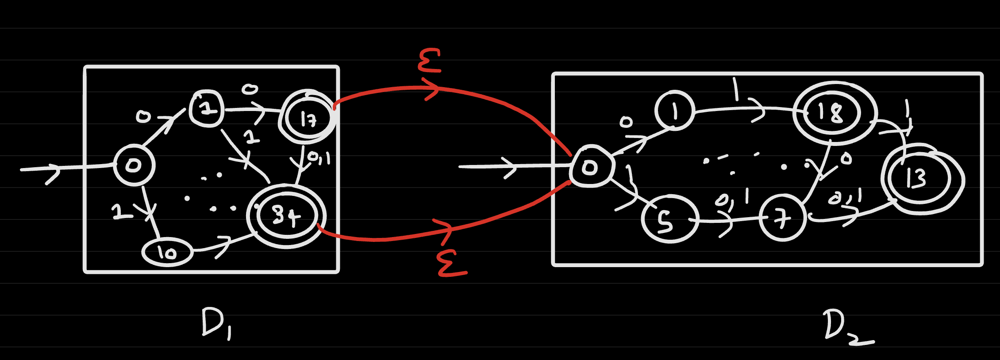
- If $f: \{0, 1\}^* \rightarrow \{0, 1\}$ is computable by a DFA $D$, then $f_{reverse}$ is computable by an NFA
  - This leverages the idea of reversing the arrows, with the new accepting state being the start state
    - The new start state will be a single dummy state that has epsilon transitions to each original end state