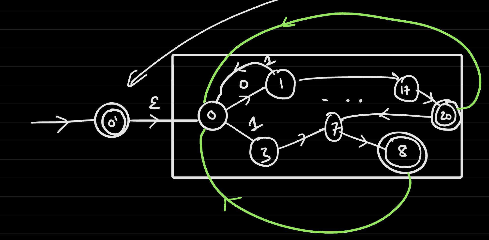
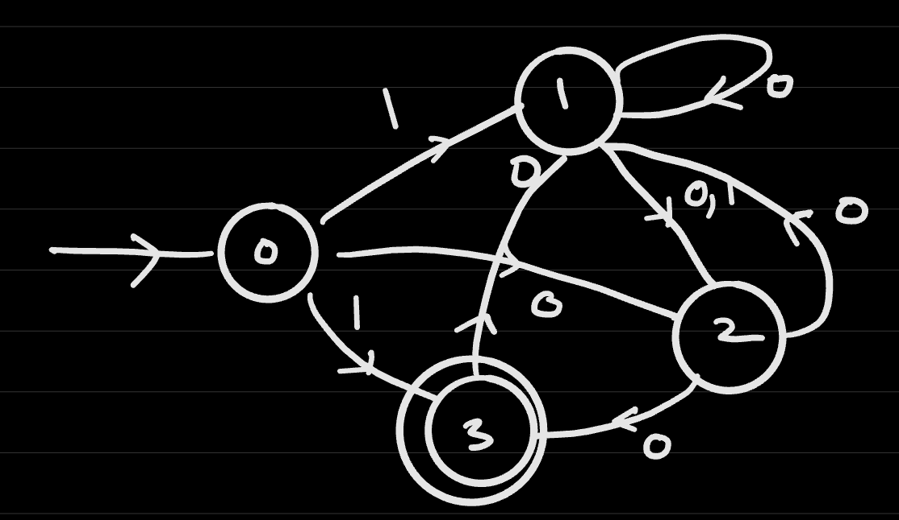
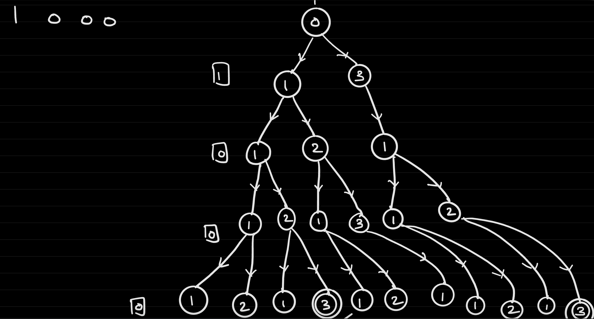
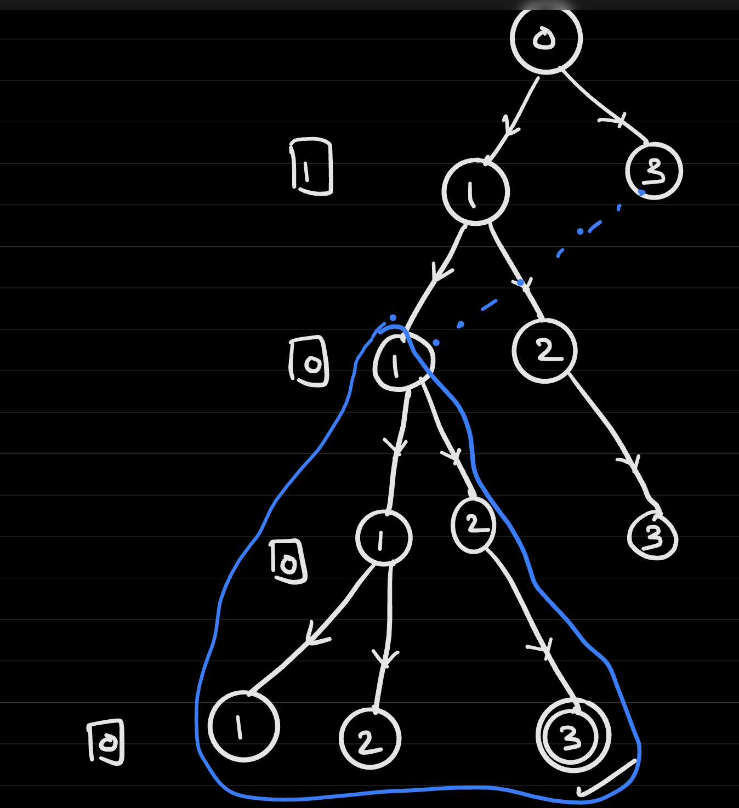
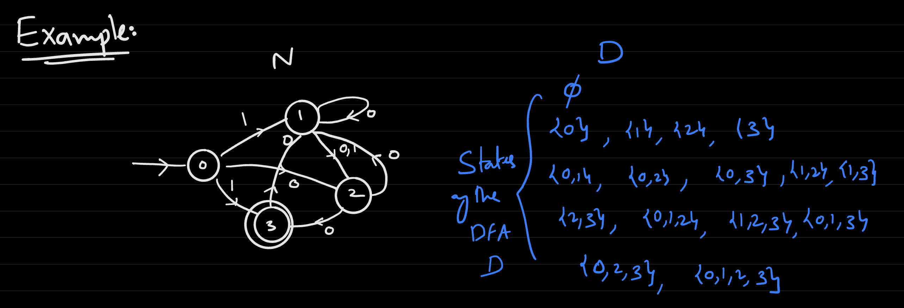
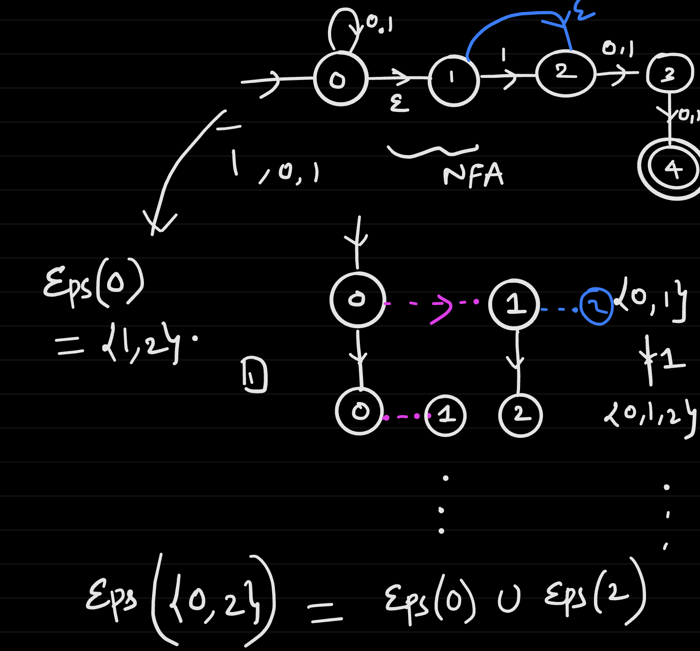

# Lecture 8
## Kleene Star Operation on Functions
- Given $f: \{0, 1\}^* \rightarrow \{0, 1\}$, we define the *Kleene Star* of *f* as $f^*: \{0, 1\}^* \rightarrow \{0, 1\}$ where, if the input *x* can be "broken up" as $x_o . x_1 ... . x_{l - 1} $ such that $f(x_0) = 1$, $f(x_1) = 1$ ..., $f(x_{l - 1}) = 1$, then $f^*$ evaluates to 1 (and 0 otherwise)
  - We consider $f^*(empty string) = 1$
- If $f$ is computable via a DFA, then $f^*$ is computable via a NFA
  - Approach: Connect the final states to the initial states via epsilon transitions
    - 
  - Whenever an accepting state is found, the computation is *restarted*
    - It must be the case that the final state is an accepting state, which is indeed the case
  - To satisfy the convention that an empty string satisfies the Kleene Star operation, an accepting initial dummy node is also added
## NFAs and DFAs
- **Theorem**: Every NFA has an equivalent DFA. For every NFA $N$, there is a DFA $D$ such that $N(x) = D(x) \forall x$
  - NFAs are often simpler to construct than DFAs - and these NFAs can be eventually converted to DFAs
  - This implies that the aforementioned functions constructed via NFAs (concatenation, reversal, and Kleene Star) are computable via DFAs
- Example:
  - 
  - 
  - It can be noticed that there is a lot of redundancy in the branching diagram - if the *state is the same, then the subtrees (sub-branches) will be the same for the same layer*
    - In the example, the rightmost subtree starting at the second level could have been "cut out" because the leftmost subtree in the same level has the same state
      - 
    - This implies, then, that at any level, there is no need to "keep track" of multiple copies of a state
- Suppose our NFA has no epsilon transitions. We are given NFA $(T_N, S_N)$, $T_N: [C] \times \{0, 1\} \rightarrow Power([C])$, $S_N \subseteq [C] = \{0, 1, 2, ..., C - 1\}$
  - We can construct a DFA $D = (T_D, S_D)$ such that $N(x)=D(x) \forall x$ be only dealing with what states are reachable at a *level*
  - The states of the DFA should be the possible subsets of states (for each level), meaning that it should be $Power([C])$
    - In general, if the NFA has $C$ states, then the resulting DFA will have $2^C$ states
    - This is constant in terms of the input length - it is only exponential in terms of the number of states
  - The transition between states can be defined as $T_D: Power([C]) \rightarrow Power([C])$
    - $T_D(I, a) = U_{i \in I} T_N(i ,a)$
      - This is the *union* of all possible states that $I$ could be after a step in the NFA
  - The accepting state $S_D$ should contain any state that has its set containing an accepting state in the original NFA
    - $S_D = I: i \in I, i \in S_N$
  - Example: 
    - 
      - $T_D(\{0\}, 1) = T_N(0, 1) = \{1, 3\}$
      - $T_D(\{1, 3\}, 0) = T_N(1, 0) \cup T_N(3, 0)$
        - $= \{1, 2\} \cup \{1\}$
        - $=\{1, 2\}$
      - $T_D(\{1, 3\}, 1) = T_N(1, 1) \cup T_N(3, 1)$
        - $= \{2\} \cup \emptyset = \{2\}$
      - This is done for *every* possible subset, checking its zero transition and its one transition
      - 
- Now, consider handling an NFA with epsilon transitions. The previous method for converting the NFA to DFA applies, but now include the epsilon transition in the transition function - this includes *chained epsilon transitions*
  - For any state $i \in \{0, 1, ..., C - 1 \}$, let $Eps(i)$ be all states that can be reached from $i$ by following the epsilon edges
  - $Eps(I) = U_{i \in I} Eps(i)$
    - This is all states that can be reached from elements of $I$ by following epsilon edges
    - 
      - $Eps(0) \cup Eps(2) = \{1, 2\}$
- Thus, given an NFA $N$ with states $[C]$, a transition function $T_N: [C] \times \{0, 1, \epsilon \} \rightarrow Power([C])$, and an accepting function $S_n \subseteq [C]$, the equivalent DFA can be constructed as
  - $States = Power([C])$
  - $T_D = Power([C]) \times \{0, 1\} \rightarrow Power([C])$
    - $T_D(I, a) = Eps(U_{i \in I} T_n(i, a))$
  - $S_D = \{I \subseteq [C]: I$ contains can element of $S_N \}$
  - Start state = $Eps({0})$
    - This accounts for the starting state having any epsilon transitions in the original NFA
- Pseudocode (Suppose no Epsilon Transitions):
  -     def computeNFA(x, Tn, Sn):
          state = {0}
          for i in range(len(x)):
            state = Union(j in state, Tn(j, x[i]))
          Return 1 if state and Sn is not the empty set and 0 else
  - Each step in the algorithm takes about O(C) time, and if an input has length $n$, then the time order is $O(nC)$