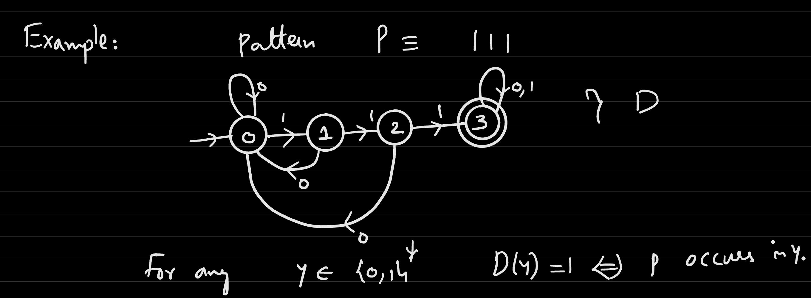
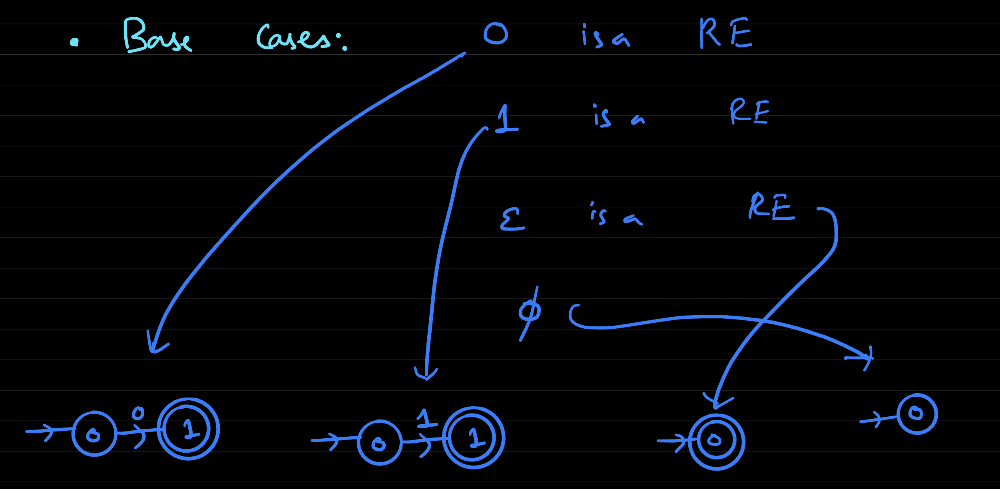

# Lecture 9
## Regular Expressions
- A direct application of NFAs is with *patern matching* 
  - There is a "Text" $x \in \{0, 1\}^*$ that is $n$ bits long and a "Pattern" $p \in \{0, 1\}^*$ that is $m$ bits long
  - Naive Pseudocode:
    -     def patternmatch(x, p):
            l = len(p)
            for i in range(0, len(x) - l):
              if x[i:i + l] == p
                return 1
    - This algorithm is of $O((n - m)(m)) = O(mn)$
  - **Knuth-Morris-Pratt (KMP) Algorithm**:
    - Given P, first construct a DFA $D$ on $m + 1$ states that recognizes whether the pattern occurs for any string ($P \in y \Longleftrightarrow D(y) = 1 $)
      - Constructing this DFA takes $O(m)$ time
    - The behavior of $D$ on $X$ can be mimicked
      - Inputting $X$ to $D$ can take at most $O(n)$ time
    Example: $P = 111$
      - 
- Definition of Regular Expressions:
  - Base Cases:
    - `0` is a regex
    - `1` is a regex
    - `∅` is a regex (null pattern)
    - `ε` is a regex (empty pattern)
  - From these bases, compound cases can be formed
    - If $r_1$ and $r_2$ regular expressions (regex), then they can be combined to form a *new* regular expression in the following ways:
      - $r_1 r_2$ is a valid regular expression (concatenation)
      - $r_1 | r_2$ is a valid regular expression (or)
      - $r_1^*$ is a valid regex (Kleene Star)
  - Given $x \in \{0, 1\}^*$ and a regex $r$, a **matching regular expression** can be defined in terms of its *base cases* and *compound cases*
    - Base Cases:
      - "0" matches regex `0`
      - "1" matches regex `1`
      - "ε" matches regex `ε`
      - Nothing matches `∅`
    - Compound Cases:
      - $x$ matches $r_1 r_2$ if $x = x_1 \bullet x_2$ where $x_1$ matches $r_1$ and $x_2$ matches $r_2$
      - $x$ matches $(r_1 | r_2)$ if $x$ matches $r_1$ or $x$ matches $r_2$
      - $x$ matches $r^*$ if $x$ can be partitioned into pieces $x_1 x_2 ... x_n$ such that each $x_i$ matches $r$
        - By convention, ε matches any Kleene Star operation
    - Examples:
      - $(0|1)^*$ matces all strings
      - $0(0|1)^*$ matches all strings starting with a `0`
      - $(10)^*$ matches all strings repeating `10`
      - $(0(10)^*|(10^*)1|(01^*)|(10)^*)$ matches any alternating string (no consecutive same bits)
      - $0^*10^*10^*10^*$ matches all strings with *exactly* three ones
      - $(0^*10^*10^*10^*)^*|0^*$ matches all strings with a number of ones that is divisible by 3
      - $(0|1)^*1(0|1)(0|1)(0|1)$ matches all strings with the fourth bit from the end being a 1
    - Given a regex $r$, $f_r: \{0, 1\}^* \rightarrow \{0, 1\}$ where $f_r$ is $1$ if $x$ matches $r$ and $0$ otherwise; $L_r = \{x \in \{0, 1\}^*: f_r(x) = 1\}$ 
      - $f$ is computed by a regex $r$ if $f(x) = f_r(x) \forall x$
      - $L$ is recognized by a regex if $L = L_r$
  - **Theorem (Kleene 1956)**:
    - For every regex $r$, there is a DFA $D$ such that $x$ matches $r$ $\Longleftrightarrow$ $D(x) = 1$
    - For every DFA $D$, there is a regex $r$ such that $D(x) = 1$ $\Longleftrightarrow$ $x$ matches $r$
  - A function $f: \{0, 1\}^* \rightarrow \{0, 1\}$ is **regular** if there is a regex computing $f$; a language $L$ is regular if there is a regex recognizing it
    - From Kleene's Theorem, this implies that a function or language is regular if it is computable via a DFA (or NFA since they can be reduced to DFAs)
  - The problem of regex matching can be solved in $O(nm)$ time or in time $O(n + 2^{O(m)})$
    - The `GREP` program converts a given regex to an equivalent NFA $N$ with $O(m)$ states and transitions (done in $O(m)$ time) and then simulates the NFA $N$ on the input $x$, which is done in $O(nm)$ time
- To construct a NFA from a regular expression, the main idea is to define regular expressions *inductively*
  - 
  - $r =r_1 r_2$ can be constructed via the *concatenation* of NFAs
  - $r = r_1 | r_2$ can be constructed via the *or* of NFAs
  - $r = r_1^*$ can be constructed via the Kleene Star of NFAs